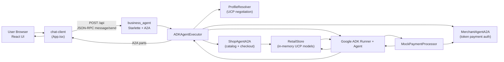
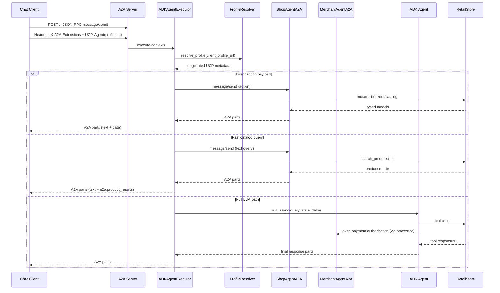
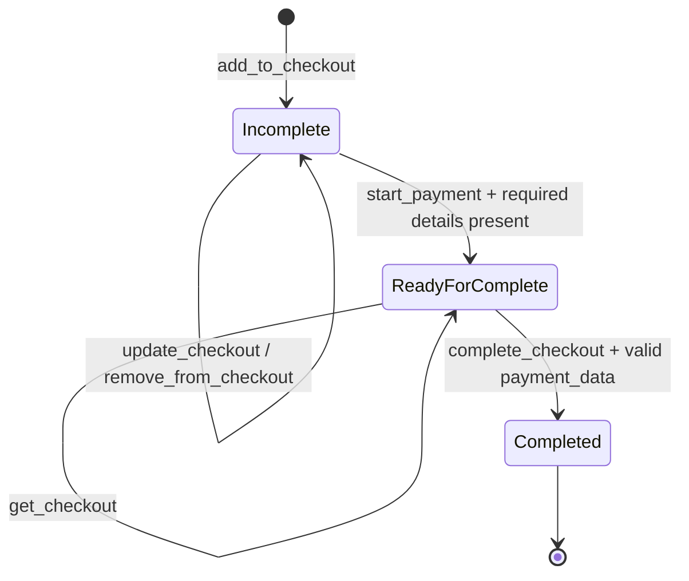

<!--
   Copyright 2026 UCP Authors

   Licensed under the Apache License, Version 2.0 (the "License");
   you may not use this file except in compliance with the License.
   You may obtain a copy of the License at

       http://www.apache.org/licenses/LICENSE-2.0

   Unless required by applicable law or agreed to in writing, software
   distributed under the License is distributed on an "AS IS" BASIS,
   WITHOUT WARRANTIES OR CONDITIONS OF ANY KIND, either express or implied.
   See the License for the specific language governing permissions and
   limitations under the License.
-->

# A2A + UCP Shopping Agent (Ollama)

This sample is a complete **Agent-to-Agent (A2A)** commerce flow that implements **Universal Commerce Protocol (UCP)** capabilities end to end.

It includes:
- A Python A2A server (`business_agent`) built with Google ADK and UCP SDK.
- A React chat client (`chat-client`) that sends A2A JSON-RPC messages and renders typed UCP data.
- A full mock commerce lifecycle: product discovery, checkout, fulfillment details, payment, and order completion.
- Nexi XPay Build v3 card collection flow (hosted fields) through backend proxy endpoints.
- Google Pay Web API integration forwarded server-side to Nexi staging endpoint.
- Ollama as the LLM backend, configured by default to `ollama/gpt-oss:120b-cloud`.

## What This Solution Does

At runtime, the system performs the following sequence:
1. Client discovers agent metadata via `/.well-known/agent-card.json` (A2A) and merchant profile via `/.well-known/ucp` (UCP).
2. Client sends `message/send` requests with:
- `X-A2A-Extensions: https://ucp.dev/specification/reference?v=2026-01-11`
- `UCP-Agent: profile="http://localhost:3000/profile/agent_profile.json"`
3. Server resolves client profile, negotiates supported UCP capabilities, and creates request-scoped UCP metadata.
4. Agent executes the request through one of three paths:
- Direct action path (structured JSON actions such as `add_to_checkout`, `complete_checkout`) without LLM roundtrip.
- Fast catalog path for common product-discovery prompts (low latency, deterministic).
- Full ADK/LLM path for natural language reasoning.
5. Server returns A2A parts (`text` and/or `data`) containing UCP payloads:
- `a2a.product_results`
- `a2a.ucp.checkout`
6. For card and wallet payment paths, client triggers Nexi proxy APIs (`/nexi/build-session`, `/nexi/finalize-payment`, `/nexi/build-state`, `/nexi/googlepay-order`) and maps successful operation payloads into UCP checkout completion.
6. Client renders typed UI cards for products, checkout summary, payment method selection, and order confirmation.

## Protocols Used

### A2A Protocol

A2A is used for:
- Agent discovery (`/.well-known/agent-card.json`)
- Transport (`JSON-RPC 2.0` over HTTP)
- Message envelopes and multi-part responses (`text`, `data`)

Current agent card values in this sample:
- `protocolVersion: 0.3.0`
- `preferredTransport: JSONRPC`
- Required extension URI: `https://ucp.dev/specification/reference?v=2026-01-11`

### UCP (Universal Commerce Protocol)

UCP is used for standardized commerce semantics:
- Capability declaration and negotiation
- Checkout model and lifecycle states
- Fulfillment and payment shape
- Merchant/client profile compatibility

Merchant profile currently exposes:
- `dev.ucp.shopping.checkout`
- `dev.ucp.shopping.fulfillment`

Client profile advertises additional capabilities (`discount`, `buyer_consent`), but runtime behavior uses the negotiated intersection.

## Architecture


If your markdown renderer does not support Mermaid, use the image above.

<details>
<summary>Mermaid Source</summary>


</details>

### Backend Components

| Component | File | Responsibility |
| --- | --- | --- |
| A2A HTTP server | `business_agent/src/business_agent/main.py` | Starts Starlette + A2A app, exposes `/.well-known/agent-card.json`, `/.well-known/ucp`, static product images |
| Request executor | `business_agent/src/business_agent/agent_executor.py` | UCP header parsing, profile negotiation, fast paths, direct actions, ADK session orchestration |
| Agent + tools | `business_agent/src/business_agent/agent.py` | Tool definitions (`search`, `checkout`, `payment`) and ADK callbacks |
| Shop + Merchant sub-agents | `business_agent/src/business_agent/a2a_subagents.py` | In-process A2A `message/send` handlers for catalog/checkout and merchant token authorization |
| Commerce store | `business_agent/src/business_agent/store.py` | In-memory catalog, checkout mutation, totals, order creation |
| UCP profile resolver | `business_agent/src/business_agent/ucp_profile_resolver.py` | Fetches client profile, validates UCP version, computes capability intersection |
| Payment processor | `business_agent/src/business_agent/payment_processor.py` | Calls merchant sub-agent using token payload and maps result to A2A task status |

### Frontend Components

| Component | File | Responsibility |
| --- | --- | --- |
| Chat orchestrator | `chat-client/App.tsx` | Sends A2A messages, tracks context/task IDs, merges multi-part responses |
| Message renderer | `chat-client/components/ChatMessage.tsx` | Renders text, products, checkout, payment selectors |
| Product cards | `chat-client/components/ProductCard.tsx` | Displays typed `Product` and add-to-checkout CTA |
| Checkout panel | `chat-client/components/Checkout.tsx` | Renders line items, totals, status, payment progression |
| Payment UX | `chat-client/components/NexiCardPaymentForm.tsx`, `GooglePayButton.tsx`, `PaymentMethodSelector.tsx`, `PaymentConfirmation.tsx` | Card hosted fields (Build v3), Google Pay real token flow, saved card selection and payment confirmation |
| Protocol dashboard | `chat-client/components/ProtocolDashboard.tsx` | Displays JSON-RPC request/response, token metadata, trace timeline, and ADK usage |

## End-to-End Request Sequence


<details>
<summary>Mermaid Source</summary>


</details>

## Checkout State Machine


<details>
<summary>Mermaid Source</summary>


</details>

## Runtime Behavior Details

### 1) Capability Negotiation

For each request, the server:
1. Verifies the UCP extension URI is requested.
2. Reads `UCP-Agent` header and extracts `profile="..."` URL.
3. Fetches client profile JSON.
4. Validates `client_version <= merchant_version`.
5. Computes the intersection of merchant and client capabilities.

Negotiated metadata is injected into agent state and used by tools/store logic.

### 2) Input Preparation

`ADKAgentExecutor._prepare_input()` merges:
- User text input
- Structured data parts
- Payment data payloads (`a2a.ucp.checkout.payment_data`, `a2a.ucp.checkout.risk_signals`)
- Optional structured action payloads (`{"action": "..."}`)

### 3) Latency-Oriented Execution Paths

This implementation intentionally avoids unnecessary LLM calls in common scenarios:
- Greeting fast path (`hi`, `hello`, ...)
- Catalog fast path (`what products do you have`, `what can I buy`, ...)
- Direct action fast path (`add_to_checkout`, `update_checkout`, `start_payment`, `complete_checkout`, etc.) through `ShopAgentA2A`
- Token validation and authorization for `complete_checkout` through `MerchantAgentA2A`
- Merchant-to-gateway simulation via UCP-style token authorization (`mock.ucp.gateway`) with transaction IDs and authorization codes

This is why UI interactions feel deterministic and faster than pure free-form LLM orchestration.

### 4) Structured Output Contract

The client expects typed A2A data keys:
- `a2a.product_results` for catalog cards
- `a2a.ucp.checkout` for checkout/payment/order UI
- `a2a.protocol_trace` for JSON-RPC/A2A/UCP exchange introspection in the protocol dashboard

The protocol dashboard also renders a human-readable call-flow timeline and highlights whether the request was executed through ADK Runner or through deterministic fast paths.

The UI now filters technical tool-call echoes and compresses verbose catalog prose when product cards are already present.

## Nexi and Google Pay Integration (Current Branch)

### Backend proxy endpoints

- `POST /nexi/build-session` -> Nexi `POST /orders/build` (version 3)
- `POST /nexi/finalize-payment` -> Nexi `POST /build/finalize_payment`
- `GET /nexi/build-state` -> Nexi `GET /build/state` fallback for delayed SDK events
- `GET /nexi/hfsdk.js` -> same-origin proxy for Nexi hosted fields SDK
- `POST /nexi/googlepay-order` -> Nexi `POST /orders/googlepay`
- `GET /googlepay/pay.js` -> same-origin proxy for Google Pay web SDK script

### Card flow behavior

1. Checkout triggers Build session creation.
2. Client auto-selects `PAY_WITH_CARD`.
3. On `CARD_DATA_COLLECTION`, secure card fields are rendered.
4. `confirmData()` starts payment confirmation.
5. On `READY_FOR_PAYMENT`, client finalizes with `/nexi/finalize-payment`.
6. If SDK state callbacks are delayed/missing, client polls `/nexi/build-state`.
7. On `PAYMENT_COMPLETE`, operation is mapped to a UCP payment instrument and sent to `complete_checkout`.

### Google Pay behavior

1. `GooglePayButton` calls `PaymentsClient.loadPaymentData(...)`.
2. Returned `googlePayPaymentData` (including tokenization payload) is forwarded to backend.
3. Backend posts to configured Nexi Google Pay endpoint with `x-api-key` in request headers.
4. Upstream error details are propagated with correlation IDs (`correlation-id` and Nexi `cid`) to simplify production troubleshooting.

### Current Google Pay staging endpoint

- `https://stg-ta.nexigroup.com/api/phoenix-0.0/psp/api/v1/orders/googlepay`

### Relevant environment variables

- `NEXI_GOOGLEPAY_ENDPOINT`
- `NEXI_GOOGLEPAY_API_KEY`
- `NEXI_GOOGLEPAY_ENABLE_FALLBACK` (default `false` in this branch)
- `NEXI_GOOGLEPAY_CAPTURE_TYPE` (supports `IMPLICIT` or `EXPLICIT`)

## Message and Payload Examples

### Discovery

```bash
curl -sS http://127.0.0.1:10999/.well-known/agent-card.json
curl -sS http://127.0.0.1:10999/.well-known/ucp
```

### `message/send` request

```json
{
  "jsonrpc": "2.0",
  "id": "req-1",
  "method": "message/send",
  "params": {
    "message": {
      "role": "user",
      "kind": "message",
      "messageId": "msg-1",
      "parts": [{ "type": "text", "text": "show me cookies available in stock" }]
    },
    "configuration": { "historyLength": 0 }
  }
}
```

Headers:
```http
Content-Type: application/json
X-A2A-Extensions: https://ucp.dev/specification/reference?v=2026-01-11
UCP-Agent: profile="http://localhost:3000/profile/agent_profile.json"
```

### Typical product response (simplified)

```json
{
  "result": {
    "parts": [
      { "kind": "text", "text": "I found 6 products for you." },
      {
        "kind": "data",
        "data": {
          "a2a.product_results": {
            "results": [{ "productID": "BISC-001", "name": "Chocochip Cookies" }]
          }
        }
      }
    ]
  }
}
```

### Direct action example

```json
{ "action": "add_to_checkout", "product_id": "BISC-001", "quantity": 1 }
```

### Payment completion example (`parts` payload)

```json
[
  { "type": "data", "data": { "action": "complete_checkout" } },
  {
    "type": "data",
    "data": {
      "a2a.ucp.checkout.payment_data": {
        "id": "instr_2",
        "type": "card",
        "brand": "visa",
        "last_digits": "8888",
        "handler_id": "example_payment_provider",
        "handler_name": "example.payment.provider",
        "credential": { "type": "token", "token": "mock_token_e2e" }
      },
      "a2a.ucp.checkout.risk_signals": { "data": "e2e-test-risk" }
    }
  }
]
```

## Setup and Run

### Prerequisites

- Python `>=3.10`
- Node.js `>=18`
- Ollama installed
- Model available in Ollama: `gpt-oss:120b-cloud`

### 1) Start backend

```bash
cd a2a/business_agent
python3 -m venv .venv
.venv/bin/python -m pip install -e .
cp env.example .env
```

In another terminal:

```bash
/usr/local/bin/ollama serve
```

Then run backend:

```bash
BUSINESS_AGENT_MODEL=ollama/gpt-oss:120b-cloud \
OLLAMA_API_BASE=http://127.0.0.1:11434 \
.venv/bin/python -m business_agent.main --host 127.0.0.1 --port 10999
```

### 2) Start frontend

```bash
cd a2a/chat-client
npm install
npm run dev -- --host 127.0.0.1 --port 3000
```

Open: [http://127.0.0.1:3000](http://127.0.0.1:3000)

### 3) Suggested interaction script

1. `hi`
2. `what can i buy?`
3. Click **Add to Checkout** on one item
4. Click **Start Payment**
5. Provide required customer details if requested
6. Click **Paga con Carta** or **Paga con Google**
7. Complete hosted fields (card) or authorize Google Pay wallet sheet
8. Confirm checkout completion and verify order status becomes `completed`

## Testing

Run backend E2E tests:

```bash
cd a2a/business_agent
.venv/bin/python -m unittest -v tests/test_a2a_e2e.py
```

Current test coverage validates:
- Discovery endpoints (`/.well-known/agent-card.json`, `/.well-known/ucp`)
- Full checkout lifecycle to completed order
- Generic catalog query behavior (`which kind of prod do you have`, `what can i buy?`)
- `update_checkout(quantity=0)` removes line item
- Nexi build session endpoint contract
- Nexi hosted SDK proxy endpoint
- Nexi build state endpoint
- Google Pay script proxy endpoint
- Order history retrieval and protocol trace presence

## Troubleshooting

### Slow or repetitive answers

- Ensure fast-path-friendly prompts for catalog discovery (`what can i buy`, `show products`, `show cookies`).
- Verify backend is running the latest code (restart server after changes).
- Confirm Ollama is reachable at `OLLAMA_API_BASE`.

### Empty or wrong UI rendering

- Hard-refresh browser (`Cmd+Shift+R`) to clear cached frontend code.
- Verify `UCP-Agent` profile URL is reachable from backend.
- Check that response includes `a2a.product_results` or `a2a.ucp.checkout` in `parts[].data`.

### Google Pay returns `401 UNAUTHORIZED` or `PS0167`

- `401 UNAUTHORIZED Authorization Missing` on staging generally indicates upstream authorization/configuration issues for the API key and merchant profile, not frontend formatting issues.
- `PS0167` generally indicates the request passed header-level checks but was rejected during Google Pay service/token handling upstream.
- Use propagated `correlation-id` and `cid` values when opening a Nexi support ticket.

### Model startup issues

- Validate model exists:

```bash
/usr/local/bin/ollama list
```

- Confirm env:
- `BUSINESS_AGENT_MODEL=ollama/gpt-oss:120b-cloud`
- `OLLAMA_API_BASE=http://127.0.0.1:11434`

## Repository Map

- Backend package: `a2a/business_agent/`
- Frontend client: `a2a/chat-client/`
- Architecture docs: `a2a/docs/`
- E2E tests: `a2a/business_agent/tests/test_a2a_e2e.py`

## Notes for Production Adaptation

This sample is intentionally lightweight and in-memory. For production use, replace:
- In-memory store with persistent backend/database
- Mock payment processor with real PSP integration
- Local static profile hosting with authenticated/validated profile endpoints
- Basic error handling/logging with structured observability and audit trails

See also: `a2a/docs/08-production-notes.md`.
