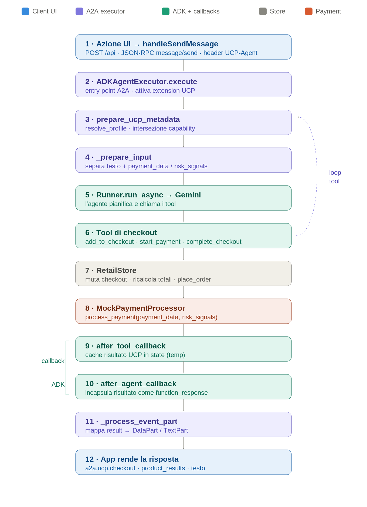

# UCP · Sample A2A — Flusso a cascata delle callback

**Specifica tecnica del percorso end-to-end di una richiesta**
Implementazione di riferimento: `a2a/business_agent` (server, Python/ADK/Gemini) + `a2a/chat-client` (client, React).
Versione UCP del sample: `2026-01-23`. Estensione A2A: `https://ucp.dev/2026-01-23/specification/overview?v=2026-01-23`.

> Scopo del documento: rendere esplicito ogni anello della catena di chiamate — dal click dell'utente al rendering del checkout — per identificare con precisione gli spazi di manovra in vista dell'integrazione di un payment gateway reale. Nessuna modifica è proposta qui: è una fotografia del codice as-is.

---

## 1. Architettura a colpo d'occhio



Il flusso ha due metà speculari. La **richiesta** scende dal client all'agente, attraversa i tool e muta lo stato di business; la **risposta** risale forzata in formato tipizzato UCP grazie a due callback ADK. Il pagamento ha inoltre una **seconda cascata, interamente client-side**, che gestisce la raccolta delle credenziali prima di richiamare il server.

---

## 2. Componenti e responsabilità

| Componente | File | Responsabilità |
|---|---|---|
| Bootstrap server | `business_agent/main.py` | Monta `A2AStarletteApplication` + `DefaultRequestHandler`; espone `/.well-known/ucp` e `/images`. |
| Executor A2A | `business_agent/agent_executor.py` → `ADKAgentExecutor` | Entry point di ogni richiesta; orchestrazione metadata UCP, input, sessione, runner, traduzione risposta. |
| Negoziazione UCP | `agent_executor.py` → `UcpRequestProcessor` + `ucp_profile_resolver.py` → `ProfileResolver` | Risolve il profilo del client, valida la versione, calcola l'intersezione delle capability. |
| Agente | `business_agent/agent.py` → `root_agent` (Gemini) | Pianifica e invoca i tool; registra le due callback ADK. |
| Tool layer | `agent.py` (funzioni tool) | Operazioni di commerce esposte all'LLM. |
| Store | `business_agent/store.py` → `RetailStore` | Stato di business in-memory: prodotti, checkout, ordini, totali, fulfillment. |
| Payment processor | `business_agent/payment_processor.py` → `MockPaymentProcessor` | Guscio del PSP server-side (oggi mock). |
| Estensione | `business_agent/a2a_extensions/ucp_extension.py` | Dichiarazione/attivazione dell'estensione UCP. |
| Client | `chat-client/App.tsx` | Costruisce le richieste JSON-RPC, gestisce stato chat e cascata pagamento. |
| Credential provider | `chat-client/mocks/credentialProviderProxy.ts` | Guscio del provider di credenziali/tokenizzazione client-side (oggi mock). |

---

## 3. Il flusso a cascata, passo per passo

Ogni passo riporta `file:riga`, firma e contratto. I numeri tra parentesi quadre corrispondono ai box del diagramma.

### [1] Azione UI → invio richiesta
`chat-client/App.tsx`

Tutte le interazioni convergono in `handleSendMessage` (`App.tsx:222`). Le scorciatoie UI impacchettano solo `parts` diversi:

- `handleAddToCheckout` (`App.tsx:79`) → `{ action: "add_to_checkout", product_id, quantity }`
- `handleStartPayment` (`App.tsx:88`) → `{ action: "start_payment" }`
- `handleConfirmPayment` (`App.tsx:181`) → due `DataPart`: `{ action: "complete_checkout" }` + `{ "a2a.ucp.checkout.payment_data": PaymentInstrument, "a2a.ucp.checkout.risk_signals": {...} }`

La richiesta è una `POST /api` JSON-RPC `message/send` (`App.tsx:291`) con header obbligatori (`App.tsx:285`):

```
X-A2A-Extensions: https://ucp.dev/2026-01-23/specification/overview?v=2026-01-23
UCP-Agent: profile="http://localhost:3000/profile/agent_profile.json"
```

`contextId` e `taskId` vengono propagati tra richieste per mantenere la sessione.

### [2] Entry point A2A — `execute`
`agent_executor.py:163` · `async def execute(self, context: RequestContext, event_queue: EventQueue) -> None`

Sequenza interna:

1. `_activate_extensions(context)` (`:201`) — per ogni estensione dichiarata nell'agent card, se `ext.uri in context.requested_extensions` la marca attiva (`context.add_activated_extension`).
2. `ucp_processor.prepare_ucp_metadata(context)` → passo [3].
3. `_prepare_input(context)` → passo [4].
4. `_get_or_create_session(context, user_id)` (`:?`) — `user_id = context.context_id` (guest per sessione).
5. `_run_agent_and_process_response(...)` → passi [5]–[11].
6. `event_queue.enqueue_event(new_agent_parts_message(result_parts, context.context_id, None))` (`:191`).

Errori non gestiti vengono incapsulati in `new_agent_text_message("Error: ...")`.

### [3] Negoziazione UCP — `prepare_ucp_metadata`
`agent_executor.py:60` · `def prepare_ucp_metadata(self, context) -> UcpMetadata`

Contratto e guardie:

- Se `A2A_UCP_EXTENSION_URL not in context.requested_extensions` → `ValueError("UCP Extension is required for this agent")`.
- Legge gli header da `context.call_context.state["headers"]`; richiede `UCP-Agent` (case-insensitive) → altrimenti `ValueError`.
- Estrae l'URL profilo con regex `profile="([^"]*)"` → altrimenti `ValueError`.
- `ProfileResolver.resolve_profile(url)` (`ucp_profile_resolver.py:63`): cache → `_fetch_profile` (httpx GET, `:49`) → confronto versioni `YYYY-MM-DD`. Se `client_version > merchant_version` → `ServerError` con `code: VERSION_UNSUPPORTED`.
- `ProfileResolver.get_ucp_metadata` (`:108`): calcola l'**intersezione** `(name, version)` tra capability client e merchant; restituisce `UcpMetadata(version, capabilities=common)`.

Questo metadata viaggia poi nello state ADK come `__ucp_metadata__` ed è usato da `add_to_checkout` per scegliere il tipo di checkout.

### [4] Estrazione input — `_prepare_input`
`agent_executor.py:213` · `def _prepare_input(self, context) -> tuple[str, dict | None]`

Separa il testo libero dai dati strutturati. Per ogni `DataPart`:

- `a2a.ucp.checkout.payment_data` → estratto e validato come `PaymentInstrument.model_validate(value)`.
- `a2a.ucp.checkout.risk_signals` → estratto as-is.
- Qualsiasi altro `DataPart` residuo viene serializzato e concatenato alla query testuale.

Ritorna `(query, payment_payload | None)`.

### [5] Esecuzione agente — `run_async`
`agent_executor.py:271` · `_run_agent_and_process_response(...)` → `runner.run_async(...)` (`:303`)

Prima costruisce lo `state_delta` iniziale (`_build_initial_state_delta`, `:247`):

| Chiave state | Costante | Contenuto |
|---|---|---|
| `__ucp_metadata__` | `ADK_UCP_METADATA_STATE` | Metadata UCP negoziato (passo [3]) |
| `__session_extensions__` | `ADK_EXTENSIONS_STATE_KEY` | Estensioni richieste |
| `__payment_data__` | `ADK_PAYMENT_STATE` | Payment data (passo [4]) |
| `temp:LATEST_TOOL_RESULT` | `ADK_LATEST_TOOL_RESULT` | Inizializzato a `None` |

`runner.run_async` esegue l'agente Gemini (`gemini-3-flash-preview`), che pianifica e chiama i tool. Gli eventi sono raccolti a partire da `is_final_response()`.

### [6] Tool di checkout
`agent.py` — funzioni registrate in `root_agent` (`:424`)

| Tool | Riga | → Store | Output key |
|---|---|---|---|
| `search_shopping_catalog` | `:51` | `search_products` | `a2a.product_results` |
| `add_to_checkout` | `:73` | `add_to_checkout` | `a2a.ucp.checkout` |
| `remove_from_checkout` | `:113` | `remove_from_checkout` | `a2a.ucp.checkout` |
| `update_checkout` | `:147` | `update_checkout` | `a2a.ucp.checkout` |
| `get_checkout` | `:181` | `get_checkout` | `a2a.ucp.checkout` |
| `start_payment` | `:327` | `start_payment` | `a2a.ucp.checkout` |
| `update_customer_details` | `:206` | `add_delivery_address` → **poi** `start_payment` | `a2a.ucp.checkout` |
| `complete_checkout` | `:264` | `process_payment` → `place_order` | `a2a.ucp.checkout` |

Lo stato del checkout corrente è tracciato in `tool_context.state["user:checkout_id"]` (`ADK_USER_CHECKOUT_ID`). `add_to_checkout` crea l'ID alla prima aggiunta; `complete_checkout` lo azzera dopo `place_order`.

### [7] Mutazione stato — `RetailStore`
`store.py`

- `add_to_checkout` (`:183`): se non esiste checkout, ne crea uno con `get_checkout_type(metadata)`, `status="incomplete"` e `payment=PaymentResponse(handlers=ucp.json["payment"]["handlers"])`. Aggiunge/incrementa la line item, poi `_recalculate_checkout`.
- `_recalculate_checkout` (`:306`): ricalcola subtotali, sconti, e — se il checkout è `FulfillmentCheckout` con fulfillment — aggiunge tassa 10% flat e shipping dall'opzione selezionata. Imposta `continue_url`.
- `add_delivery_address` (`:400`): crea destination, gruppo e metodo di fulfillment (`shipping`), opzione default `standard`.
- `start_payment` (`:452`): valida presenza di `buyer.email` e fulfillment; se ok → `status="ready_for_complete"`, altrimenti ritorna la stringa con i campi mancanti.
- `place_order` (`:484`): `status="completed"`, genera `OrderConfirmation(id="ORD-<checkout_id>", permalink_url=...)`, sposta in `_orders` e rimuove da `_checkouts`.

### [8] Pagamento server-side — `MockPaymentProcessor`
`payment_processor.py:27` · `def process_payment(self, payment_data: PaymentInstrument, risk_data=None) -> Task`

Stato attuale: ritorna **sempre** `Task(status=TaskStatus(state=TaskState.completed))`. È il punto in cui un PSP reale eseguirebbe authorize/capture e valuterebbe `risk_data`. Invocato solo da `complete_checkout` (`agent.py:296`); l'ordine viene piazzato unicamente se `task.status.state == TaskState.completed` (`agent.py:303`).

### [9] Callback `after_tool_callback`
`agent.py:366` · `def after_tool_modifier(tool, args, tool_context, tool_response) -> dict | None`

Scatta dopo **ogni** tool. Se l'estensione UCP è attiva (`UcpExtension.URI in __session_extensions__`) e la risposta contiene una chiave UCP (`a2a.ucp.checkout` o `a2a.product_results`), salva l'intera risposta in `tool_context.state["temp:LATEST_TOOL_RESULT"]`. Ritorna `None` (non altera la risposta del tool). Il prefisso `temp:` indica vita limitata al turno.

### [10] Callback `after_agent_callback`
`agent.py:395` · `def modify_output_after_agent(callback_context) -> types.Content | None`

Scatta a fine run dell'agente. Legge `temp:LATEST_TOOL_RESULT`; se presente, **scavalca la sintesi testuale del modello** restituendo un `types.Content` con un `FunctionResponse(response={"result": latest_result})`. È il meccanismo che garantisce che i dati UCP tipizzati raggiungano il client invece di una parafrasi in linguaggio naturale. Coerente con `start_payment` che imposta `tool_context.actions.skip_summarization = True` (`agent.py:346`).

### [11] Traduzione in parts — `_process_event_part`
`agent_executor.py:328` · `def _process_event_part(self, part) -> TextPart | DataPart | None`

Regole di mappatura:

- `function_response.response["result"]` di tipo `dict` → `DataPart(data=result)`.
- `function_response.response["result"]` di tipo `str` → `TextPart(text=result)`.
- `part.text` semplice → `TextPart`.

Le parti risultanti sono accodate con `new_agent_parts_message` (`agent_executor.py:191`) e tornano al client.

### [12] Rendering — client
`chat-client/App.tsx`

La risposta è smistata per chiave: `a2a.product_results` (lista prodotti), `a2a.ucp.checkout` (oggetto checkout), testo. Il componente `CheckoutComponent` mostra "Start Payment" oppure "Complete Payment" a seconda di `checkout.status`.

---

## 4. Cascate interne notevoli

Due punti dove una singola chiamata ne innesca un'altra senza ritorno all'LLM — vanno conosciuti perché alterano la sequenza apparente dei tool:

1. **`update_customer_details` → `start_payment`** (`agent.py:261`): aggiungere l'indirizzo porta il checkout fino a `ready_for_complete` in un solo tool call. Il `return` del primo tool è il risultato del secondo.
2. **`complete_checkout` → `process_payment` → `place_order`** (`agent.py:296`–`309`): l'ordine è piazzato solo se il `Task` di pagamento è `completed`; in caso contrario, errore o `requires_more_info`.

Una terza cascata è **interamente client-side** (vedi §6): la raccolta credenziali tramite `CredentialProviderProxy`.

---

## 5. Macchina a stati del checkout

| Stato | Impostato da | Significato | Transizione successiva |
|---|---|---|---|
| `incomplete` | `add/remove/update_checkout`, `_recalculate_checkout` | Carrello modificabile | `ready_for_complete` via `start_payment` |
| `ready_for_complete` | `store.start_payment` (`store.py:452`) | Buyer + fulfillment presenti | `completed` via `complete_checkout` |
| `completed` | `store.place_order` (`store.py:484`) | Ordine confermato | terminale (checkout rimosso, ordine archiviato) |

Guardie a `ready_for_complete`: `buyer` non nullo (email) e, per `FulfillmentCheckout`, `fulfillment` non nullo. In assenza, `start_payment` ritorna i campi mancanti come stringa con `status: requires_more_info`.

---

## 6. La cascata pagamento lato client

Attivata quando `checkout.status === "ready_for_complete"` e l'utente preme "Complete Payment":

1. `handlePaymentMethodSelection(checkout)` (`App.tsx:95`) — cerca nel checkout l'handler con `id === "example_payment_provider"` (`App.tsx:107`), dichiarato dal merchant in `ucp.json → payment.handlers`.
2. `credentialProvider.getSupportedPaymentMethods(user_email, handler.config)` (`credentialProviderProxy.ts`) → restituisce `payment_method_aliases` → render `PaymentMethodSelector`.
3. `handlePaymentMethodSelected(method)` (`App.tsx:140`) → `getPaymentToken(user_email, method)` → restituisce un `PaymentInstrument` con `credential: { type: "token", token: ... }` e `handler_id` → render `PaymentConfirmation`.
4. `handleConfirmPayment(instrument)` (`App.tsx:181`) → invia `complete_checkout` + `payment_data` + `risk_signals` al server (rientra in [1]).

Tutto questo gira nel mock `CredentialProviderProxy`: nessuna chiamata di rete reale, carte fittizie (amex/visa/mastercard).

---

## 7. Contratti dei payload UCP

### Header (client → server)

| Header | Valore | Verificato in |
|---|---|---|
| `X-A2A-Extensions` | URI estensione UCP | `prepare_ucp_metadata` (richiesto) |
| `UCP-Agent` | `profile="<url>"` | `prepare_ucp_metadata` (regex, richiesto) |

### Chiavi dati (costanti in `constants.py`)

| Chiave | Costante | Direzione | Tipo |
|---|---|---|---|
| `a2a.ucp.checkout` | `UCP_CHECKOUT_KEY` | server → client | `CheckoutResponse` |
| `a2a.product_results` | — | server → client | `ProductResults` |
| `a2a.ucp.checkout.payment_data` | `UCP_PAYMENT_DATA_KEY` | client → server | `PaymentInstrument` |
| `a2a.ucp.checkout.risk_signals` | `UCP_RISK_SIGNALS_KEY` | client → server | oggetto opaco |

### State keys ADK (server, per turno)

`user:checkout_id`, `__ucp_metadata__`, `__session_extensions__`, `__payment_data__`, `temp:LATEST_TOOL_RESULT`.

### Handler di pagamento dichiarato (`data/ucp.json`)

```json
{
  "id": "example_payment_provider",
  "name": "example.payment.provider",
  "version": "2026-01-23",
  "spec": "https://pay.provider.example/specs/handlers/payments",
  "config_schema": "https://pay.provider.example/specs/handlers/config.json",
  "instrument_schemas": [
    "https://ucp.dev/2026-01-23/schemas/shopping/types/card_payment_instrument.json"
  ],
  "config": { "business_id": "1234567890" }
}
```

L'`id` qui è il contratto tra merchant e client: il client cerca esattamente questa stringa (`App.tsx:107`).

---

## 8. Punti di estensione per il payment gateway

I tre gusci sono disaccoppiati e comunicano solo attraverso `PaymentInstrument`, `payment_data` e `risk_signals`. Sono quindi sostituibili in modo indipendente.

| Punto di innesto | File · simbolo | Ruolo oggi | Cosa farebbe un gateway reale |
|---|---|---|---|
| PSP server-side | `payment_processor.py:27` · `MockPaymentProcessor.process_payment` | Ritorna sempre `completed` | Authorize/capture, gestione `risk_data`, esiti di rifiuto |
| Provider credenziali client | `mocks/credentialProviderProxy.ts` · `getSupportedPaymentMethods`, `getPaymentToken` | Carte mock, token finto | Tokenizzazione/network tokenization, vaulting, SDK del provider |
| Dichiarazione handler | `data/ucp.json` · `payment.handlers[].id`/`config`/`instrument_schemas` | `example_payment_provider` | `id`, schema instrument e `config` del provider reale |

Conseguenze del disaccoppiamento: cambiare `id` in `ucp.json` cambia quale provider il client interroga; sostituire `process_payment` cambia l'esito server senza toccare il client; sostituire il `CredentialProviderProxy` cambia la tokenizzazione senza toccare il server. Il contratto stabile da preservare è la forma del `PaymentInstrument` e le due chiavi `payment_data`/`risk_signals`.

---

## 9. Limiti del sample (rilevanti per la produzione)

- Stato in-memory (`RetailStore`, `InMemorySessionService`, `InMemoryTaskStore`): nessuna persistenza, nessuna concorrenza.
- Pagamento sempre approvato: nessun percorso di rifiuto, 3DS, idempotenza o riconciliazione.
- `risk_signals` ricevuto ma non valutato.
- Tassa flat 10% e shipping hard-coded (`store.py`).
- Cancellazione task non implementata (`ADKAgentExecutor.cancel` → `NotImplementedError`).
- Profilo client risolto via httpx senza retry/timeout espliciti.

---

*Riferimenti file relativi alla root `a2a/`. Numeri di riga allineati al sample alla data di analisi.*
